# Point of Sale (POS) System - Qt/C++/SQLite

A feature-rich desktop Point of Sale (POS) system built using **Qt (Widgets)** for the user interface, **C++** for the application logic, and **SQLite** for the backend database. This application is designed for small restaurants or cafés and provides functionality to manage menu items, process customer sales, generate receipts, and track daily/monthly performance.

---

## 🚀 Features

- 📋 **Sales Entry & Receipt Generation**
  - Add items to a sale with quantity, auto-fill prices, and view total.
  - Generate clean, formatted receipts in PDF format.

- 📦 **Menu Management**
  - Category-wise item catalog.
  - Add, edit, and delete items with real-time updates.
  - Dynamic category handling with searchable dropdowns.

- 📊 **Sales History & Reporting**
  - View all past sales with timestamps.
  - Filter sales by date range or view today's sales.
  - Display total daily sales.
  - Export sales data as CSV.
  - Generate monthly reports and summaries.

- 🧭 **Collapsible Sidebar Navigation**
  - Hamburger-style dashboard with access to Sale History and Menu Manager.

- 🔍 **Smart Input**
  - Auto-suggest menu items during sales.
  - Automatically populate item prices based on selection.

---

## 🛠️ Tech Stack

| Layer        | Technology            |
|--------------|------------------------|
| Frontend     | Qt Widgets (C++)       |
| Logic        | C++                    |
| Database     | SQLite (local .db)     |
| UI Design    | Qt Designer (.ui files)|
| PDF Export   | QTextDocument & QPrinter |

---

## 📷 Screenshots

### 🏠 Home Page
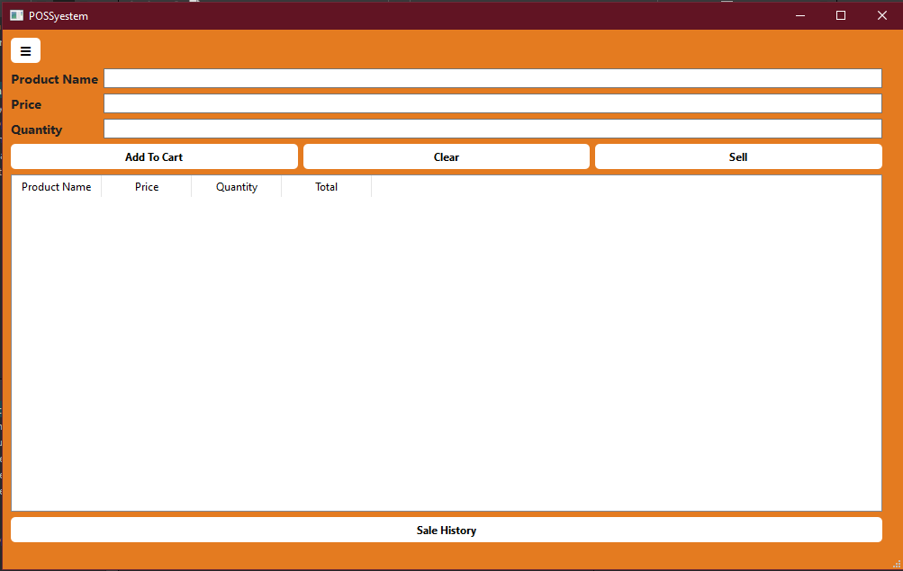

### 🛒 Item Added to Cart
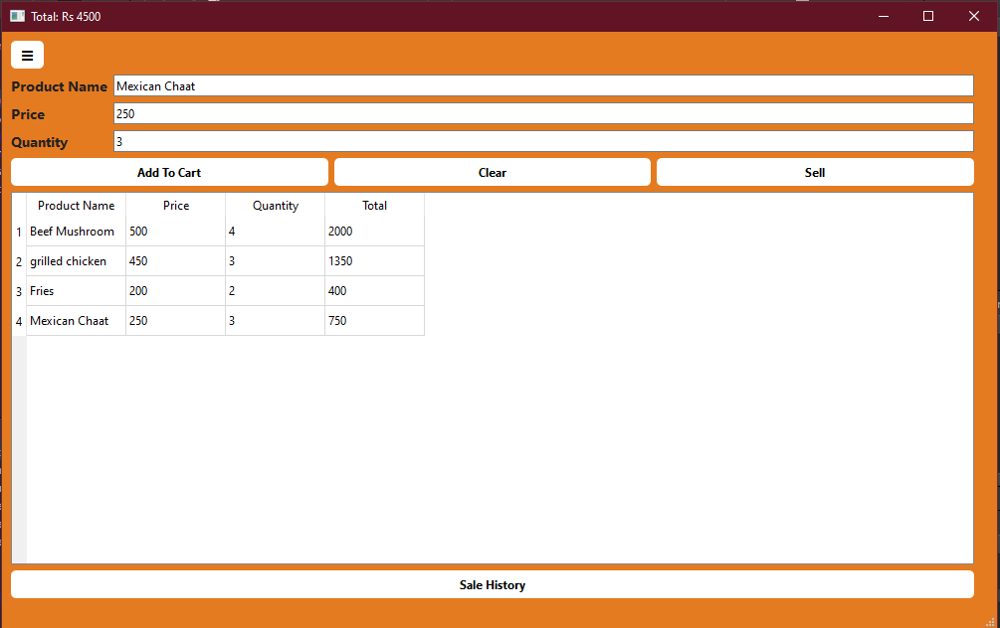

### 🧾 Receipt Generated
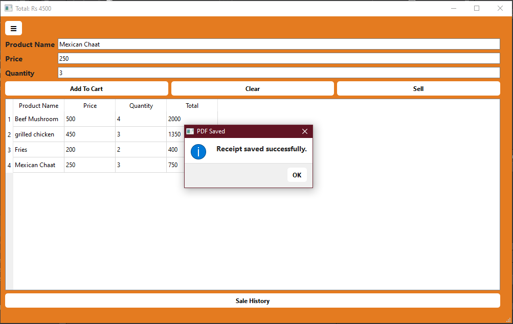

### 🔢 Daily Total Calculation
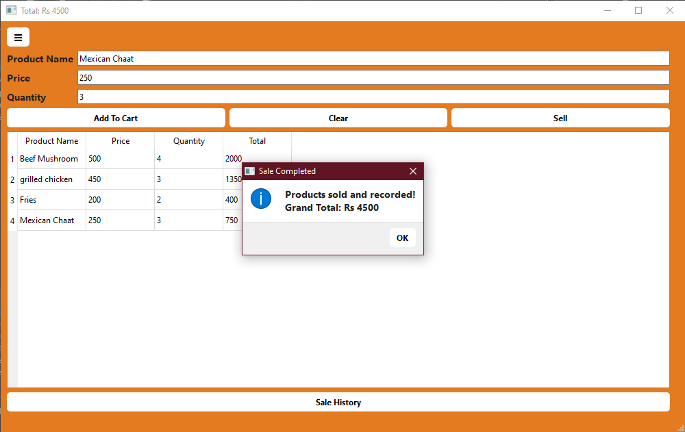

### 🍔 Menu Manager
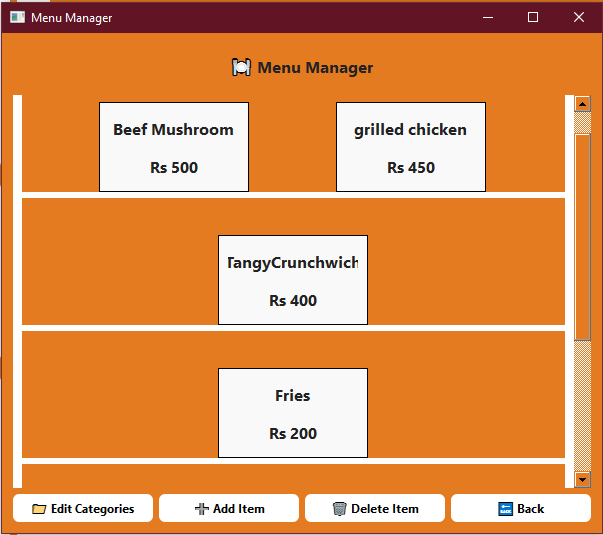

### ➕ Add New Item
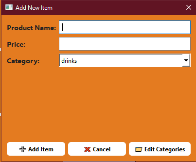

### 🗂️ Category Manager
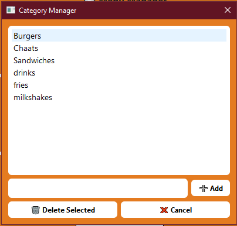

### 📊 Sales History Page
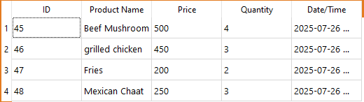

### 📅 Sales Filtered by Date
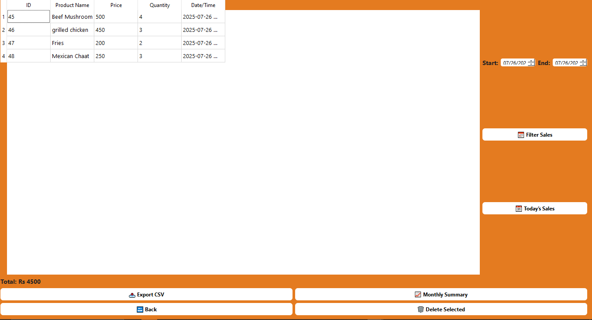

### 📥 Exported to CSV (Opened in Excel)
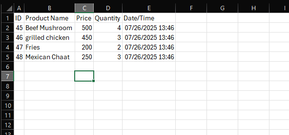

### 💹 CSV File Downloaded
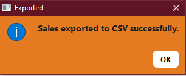

---

## 📂 Project Structure

